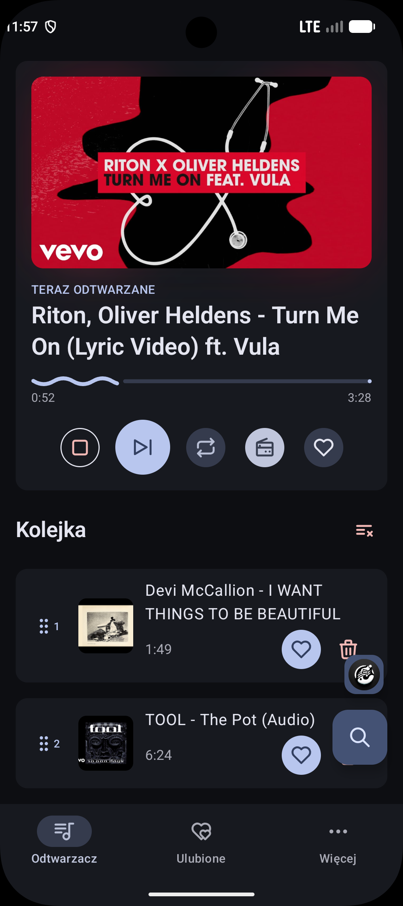
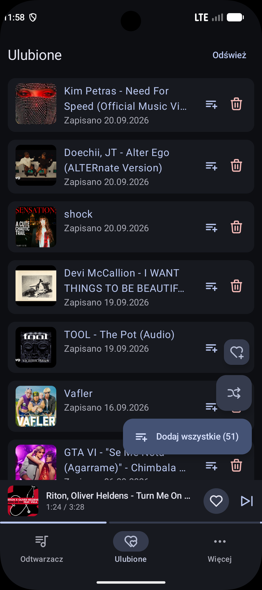
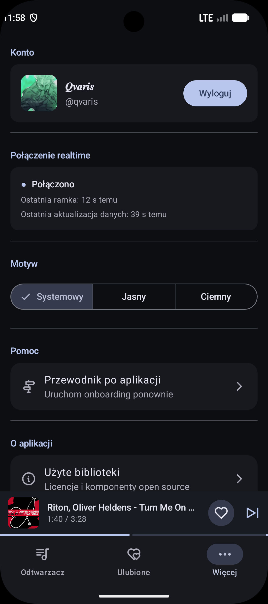

# KajutaBot Android

Native Android client for controlling KajutaBot, a Discord music bot, through its existing Control API. The phone controls playback on Discord; it does not play the audio locally.

## Features

- Discord OAuth login or credential-free guest access to a demo server
- Discord server and voice channel selection
- Live player state, playback controls and queue management
- Track search, URL sharing and favorites
- Material 3 UI with system dynamic colors on Android 12+
- Android media controls through Media3

## Screenshots

| Player and queue | Favorites | More and realtime status |
| :---: | :---: | :---: |
| <a href="docs/screenshots/player.png"></a> | <a href="docs/screenshots/favorites.png"></a> | <a href="docs/screenshots/more.png"></a> |

## Tech stack

Kotlin, Jetpack Compose, Material 3, Coroutines/Flow, Retrofit, OkHttp, kotlinx.serialization, SignalR, Coil 3, Media3, Navigation Compose and Gradle Kotlin DSL. Unit tests use JUnit, kotlinx-coroutines-test, MockWebServer and Turbine.

## Architecture

- `:app` contains the Compose UI, ViewModels, navigation, Android session storage and media service. ViewModels expose `StateFlow` UI state; route Composables collect it and send user actions back to the ViewModels.
- `:api` is a Kotlin/JVM module with Retrofit endpoints, transport configuration, SignalR client and API DTOs. It has no Android SDK dependency. `:app` depends on `:api`.
- A small application-owned container constructs shared services and scopes player state to the signed-in session.

## Interesting implementation details

- **Realtime state:** A SignalR connection is shared by the UI and media service. It reconnects with backoff and recovers queue state through the REST API when an initial snapshot is missing.
- **Queue concurrency:** Mutations send the queue version and apply the snapshot returned by the server. On a version conflict, the client reloads the queue and reports the change.
- **Authentication:** Discord OAuth uses PKCE and a checked `state` value. Access tokens are refreshed through a separate anonymous API client; session tokens are encrypted with an Android Keystore AES-GCM key and excluded from Android backups.
- **System integration:** Media3 exposes the remote bot playback to Android media controls. Coil loads and caches track artwork, while the native theme can use Material You colors.

## Running locally

### Requirements

- Android Studio with Android SDK Platform 37 installed. The project uses Android Gradle Plugin 9.4.1 and the checked-in Gradle 9.7.1 wrapper.
- JDK 25 for the Gradle daemon. The checked-in daemon criteria can provision it through Foojay on first sync; an internet connection is needed for this and initial dependency downloads. The `:api` compilation toolchain is JDK 17.
- Emulator or physical device running Android 10 (API 29) or newer.

### Clone

```bash
git clone https://github.com/kcrg/kajutabot-android.git
cd kajutabot-android
```

### Configuration

The repository already contains the public Control API URL and Discord application client ID in `gradle.properties`. No private credentials, keystore, custom environment variables or additional `local.properties` values are needed for the default debug build or guest flow. Android Studio normally creates `local.properties` with the local `sdk.dir`; it is ignored by Git.

To use another backend or Discord application, override `KAJUTABOT_API_BASE_URL` and `KAJUTABOT_DISCORD_CLIENT_ID` in your user-level Gradle properties (`~/.gradle/gradle.properties`) or pass them with `-P` when building. These are public identifiers embedded in `BuildConfig`, not secrets. The backend must allow the OAuth redirect URI `discord-<CLIENT_ID>:/authorize/callback`, and the same URI must be registered for the Discord application. The default guest flow does not require configuring OAuth.

### Build and run

```bash
./gradlew assembleDebug
./gradlew installDebug
```

On Windows:

```powershell
.\gradlew.bat assembleDebug
.\gradlew.bat installDebug
```

For the simplest run, open the cloned directory in Android Studio, let Gradle sync, select an API 29+ emulator or connected device, then run the `app` configuration. `installDebug` requires a running emulator or connected device.

### Guest access

On the login screen, tap **Wypróbuj jako gość** (“Try as guest”). The app requests a guest session from the configured Control API; no Discord login or credentials are needed. In onboarding, continue to the last page, select a voice channel on the preselected demo server, and tap **Zaczynamy**. Guest access needs an internet connection and an available demo backend; it cannot be used with an arbitrary self-hosted API unless that backend supports guest sessions.

## Tests and checks

```bash
./gradlew :api:test :app:testDebugUnitTest :app:lintDebug :app:assembleDebug :app:assembleRelease
```

On Windows, use `.\gradlew.bat` in place of `./gradlew`. `assembleRelease` is an unsigned local compilation and R8 check; the project has no release signing configuration. Instrumented tests under `app/src/androidTest` require a device and are not part of this command.

## Project status

This is an actively developed Android client for the existing KajutaBot Control API.
